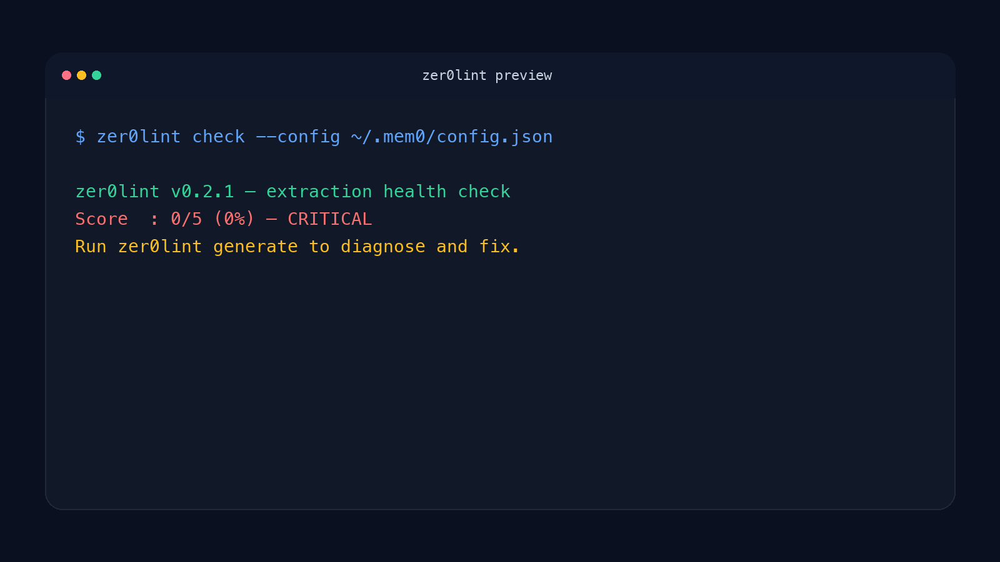

# zer0lint

zer0lint is a memory-extraction diagnostic that flags silent failure modes in mem0 configs and HTTP memory endpoints — cases where ingestion reports success but the facts your agent needed never survive the LLM extraction step.

`zer0lint` runs a fail-fast extraction health check, shows whether ingestion is actually working, and generates a better extraction prompt when it is not.

- "mem0 says add worked, but the agent still forgets the important part."
- "Search returns something, but not the specific fact I stored."
- "We switched models and memory quality got worse for no obvious reason."
- "Our retrieval benchmark looks fine, but the batch behavior is still wrong."
- "I need to know if extraction is broken before I waste time tuning retrieval."

```bash
pip install zer0lint
```

```bash
zer0lint check --config ~/.mem0/config.json
```

```text
Score  : 0/5 (0%) — CRITICAL
Run zer0lint generate to diagnose and fix.
```

**When To Use It**

Use `zer0lint` when your memory system ingests text through an LLM extraction step and you need to verify whether facts survive that step.

**When Not To Use It**

Do not use `zer0lint` for vector-store outages, API connectivity failures, or as proof that one prompt fix will generalize to every memory pipeline.



## The Problem

The failure is invisible. `add()` returns `{"results": [...]}`. `search()` returns results. But when the LLM extraction step produces malformed JSON or drops specifics, the facts never land — degraded fallbacks get stored instead. You won't see an error. You'll just notice your agent doesn't remember.

zer0lint surfaces this by injecting known facts and checking how many survive the round-trip. The illustrative output below shows what a failing extraction step looks like — run it against your own config for real numbers:

```
Score  : 0/5 — CRITICAL
  ⚠  Model upgrade: We switched from gpt-3.5-turbo to gpt-4o-mini...
  ⚠  API endpoint: The API service runs on port 8421 with TLS 1.3...
  ⚠  CI status: CI pipeline passed at commit a3f8c12...
  ⚠  Configuration: Auth tokens expire after 3600 seconds...
  ⚠  Version update: Updated Redis cluster to v7.2.4...
```

---

## Quick Start

```bash
pip install zer0lint

# Step 1: diagnose
zer0lint check --config ~/.mem0/config.json

# Step 2: fix (if score < 80%)
zer0lint generate --config ~/.mem0/config.json

# Dry run first if you want to see what changes before applying
zer0lint generate --config ~/.mem0/config.json --dry-run
```

Your original config is always backed up before any changes are written.

### Universal HTTP mode

Not using mem0? zer0lint works with **any memory system** that exposes add/search over HTTP:

```bash
# Point at any memory server — no mem0 dependency needed
zer0lint check --add-url http://localhost:19420/add --search-url http://localhost:19420/recall_b

# Generate and save the extraction prompt for your system
zer0lint generate --add-url http://localhost:19420/add --search-url http://localhost:19420/recall_b --save-prompt prompt.txt
```

Works with cogito-ergo, Zep, LangMem, or any custom HTTP memory API.

---

## What It Does

### `zer0lint check`

Injects 5 synthetic technical facts into your live mem0 instance, then measures round-trip recall. Uses your existing LLM — no new API keys or models required.

```
zer0lint v0.2.1 — extraction health check
Config : ~/.mem0/config.json
Model  : mistral:7b
Prompt : default (mem0 built-in)

Error in new_retrieved_facts: Unterminated string starting at: line 1 column 10 (char 9)
Error in new_retrieved_facts: Expecting ',' delimiter: line 1 column 13 (char 12)

[CHECK] Using model: mistral:7b
[CHECK] Testing with 5 synthetic facts...
[CHECK] Score: 0/5 (0%) — CRITICAL
  ⚠  Model upgrade: We switched from gpt-3.5-turbo to gpt-4o-mini...
  ⚠  API endpoint: The API service runs on port 8421 with TLS 1.3...
  ⚠  CI status: CI pipeline passed on 2026-03-22 at commit a3f8c12...
  ⚠  Configuration: Auth tokens expire after 3600 seconds...
  ⚠  Version update: Updated Redis cluster to v7.2.4...

Score  : 0/5 (0%) — CRITICAL
Run zer0lint generate to diagnose and fix.
```

Statuses: **HEALTHY** (≥80%) · **ACCEPTABLE** (60–79%) · **DEGRADED** (40–59%) · **CRITICAL** (<40%)

### `zer0lint generate`

3-phase diagnostic + fix. Validates the prompt works before applying it. Never writes without proof of improvement.

1. **Baseline** — test your current config as-is
2. **Re-test** — apply zer0lint's domain-aware extraction prompt at config level
3. **Apply** — if improved, write the validated prompt to your config (with backup)

Example run shape (your numbers depend on your model and config):

```
[1/3] Baseline — testing current config as-is...
  Baseline score: <n>/5
    ❌ Configuration
    ❌ API endpoint
    ❌ CI status
    ❌ Model upgrade
    ❌ Version update

[2/3] Re-testing with zer0lint technical extraction prompt (config-level)...
  Improved score: <m>/5
    ✅ Configuration
    ✅ API endpoint
    ✅ CI status
    ✅ Model upgrade
    ✅ Version update

[3/3] Applying fix to config (only if the score improved)...
  ✅ Config updated.
  Backup at: ~/.mem0/config.backup.<timestamp>.json
```

---

## Critical Discovery: Where Extraction Actually Happens

Most developers who hit this problem try to fix it by passing a custom prompt at call time:

```python
memory.add("...", prompt="extract technical facts")  # does nothing
```

**This has no effect in mem0 v1.x.** The extraction prompt must live in the config — specifically in the `custom_fact_extraction_prompt` field. There is no error when you pass it to `add()`. It simply has zero effect on what gets extracted.

zer0lint writes the validated prompt to the correct location. That's the fix.

---

## Config Format

zer0lint reads a standard mem0 config JSON. Example:

```json
{
  "llm": {
    "provider": "ollama",
    "config": {
      "model": "mistral:7b",
      "ollama_base_url": "http://localhost:11434"
    }
  },
  "vector_store": {
    "provider": "chroma",
    "config": {
      "collection_name": "my_agent_memory",
      "path": "~/.mem0/chroma"
    }
  }
}
```

After `zer0lint generate`, it adds:

```json
{
  "custom_fact_extraction_prompt": "You are a Technical Memory Organizer..."
}
```

If you're using cogito-ergo, your config lives at `~/.cogito/config.json` — same format. Or skip the config entirely and use HTTP mode with cogito-ergo's endpoints.

---

## What zer0lint Checks

zer0lint injects a fixed set of synthetic technical facts into your memory instance, then measures how many survive the extraction round-trip via recall. It reports a score, a percentage, a health status, and per-fact pass/fail so you can see exactly which facts were dropped.

Smaller models that struggle to emit well-formed structured JSON are the common failure case: the default extraction prompt can produce malformed output (`Unterminated string`, `Expecting ',' delimiter`) and silently drop facts. `zer0lint generate` proposes a stronger extraction prompt, re-runs the same check, and only writes the new prompt to config if the score improves — so any improvement is validated on your own model and config, not asserted.

---

## How It Works

zer0lint borrows the LLM you already have configured in your mem0 config. No new API keys, no new models, no cloud calls beyond what you already use.

It injects known facts, measures how many survive the extraction round-trip, generates a prompt that improves the score, validates the improvement, then writes to config. Your original is backed up with an ISO timestamp before anything is changed.

---

## Installation

```bash
# From PyPI (recommended)
pip install zer0lint

# From source
git clone https://github.com/hermes-labs-ai/zer0lint
cd zer0lint
pip install -e .
```

**Requirements:** Python 3.9+. For mem0 config mode: `pip install zer0lint[mem0]`. For HTTP mode: no extra dependencies.

---

## Supported Systems

zer0lint is architected to work over HTTP with any memory system that exposes add/search endpoints. It should work for most agent memory setups if configured correctly.

| System | Status | How |
|---|---|---|
| mem0 v1.x | ✅ | `--config` flag |
| cogito-ergo | ✅ | `--add-url` + `--search-url` |
| Agent Gorgon | ✅ | `--add-url` + `--search-url` |
| Any HTTP memory API | ✅ | `--add-url` + `--search-url` |

---

## License

Apache 2.0

---

## About Hermes Labs

Hermes Labs is an independent AI-reliability lab building open-source tools that catch silent failure modes in production AI. More at [hermes-labs.ai](https://hermes-labs.ai).
