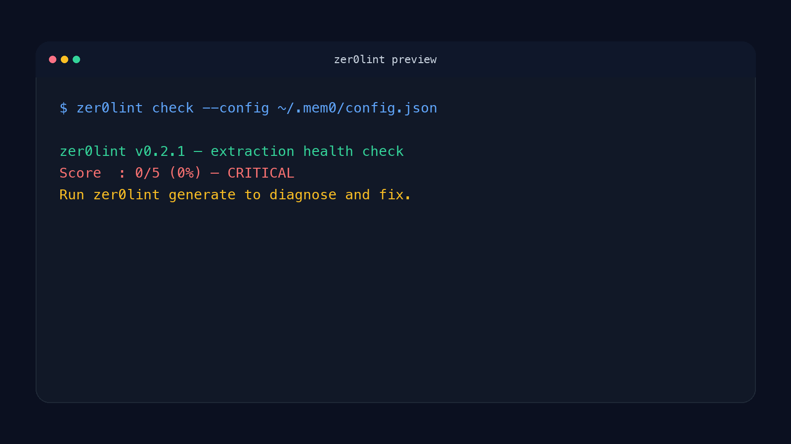

# zer0lint

[](https://github.com/hermes-labs-ai/zer0lint/actions/workflows/ci.yml)
[](https://pypi.org/project/zer0lint/)
[](https://pypi.org/project/zer0lint/)
[](LICENSE)

zer0lint is a memory-extraction diagnostic that flags silent failure modes in mem0 configs and HTTP memory endpoints — cases where ingestion reports success but the facts your agent needed never survive the LLM extraction step.

> Part of the [Hermes Labs](https://github.com/hermes-labs-ai) reliability stack.

`zer0lint` runs a fail-fast extraction health check, shows whether ingestion is actually working, and generates a better extraction prompt when it is not.

- "mem0 says add worked, but the agent still forgets the important part."
- "Search returns something, but not the specific fact I stored."
- "We switched models and memory quality got worse for no obvious reason."
- "Our retrieval benchmark looks fine, but the batch behavior is still wrong."
- "I need to know if extraction is broken before I waste time tuning retrieval."

```bash
# For mem0 config mode (includes the mem0 dependency)
pip install "zer0lint[mem0]"
```

```bash
zer0lint check --config ~/.mem0/config.json
```

```text
Score  : 0/5 (0%) — CRITICAL
Run zer0lint generate to diagnose and fix.
```

**When To Use It**

Use `zer0lint` when your memory system ingests text through an LLM extraction step and you need to verify whether facts survive that step.

**When Not To Use It**

Do not use `zer0lint` for vector-store outages, API connectivity failures, or as proof that one prompt fix will generalize to every memory pipeline.



## The Problem

The failure is invisible. `add()` returns `{"results": [...]}`. `search()` returns results. But when the LLM extraction step produces malformed JSON or drops specifics, the facts never land — degraded fallbacks get stored instead. You won't see an error. You'll just notice your agent doesn't remember.

zer0lint surfaces this by injecting known facts and checking how many survive the round-trip. The illustrative output below shows what a failing extraction step looks like — run it against your own config for real numbers:

```
Score  : 0/5 — CRITICAL
  ⚠  Model upgrade: We switched from gpt-3.5-turbo to gpt-4o-mini...
  ⚠  API endpoint: The API service runs on port 8421 with TLS 1.3...
  ⚠  CI status: CI pipeline passed at commit a3f8c12...
  ⚠  Configuration: Auth tokens expire after 3600 seconds...
  ⚠  Version update: Updated Redis cluster to v7.2.4...
```

---

## Quick Start

```bash
# For mem0 config mode (includes the mem0 dependency)
pip install "zer0lint[mem0]"

# Step 1: diagnose
zer0lint check --config ~/.mem0/config.json

# Step 2: fix (if score < 80%)
zer0lint generate --config ~/.mem0/config.json

# Dry run first if you want to see what changes before applying
zer0lint generate --config ~/.mem0/config.json --dry-run
```

In mem0 config mode, your original config is backed up (timestamped) before any changes are written.

### Universal HTTP mode

Not using mem0? zer0lint works with **any memory system** that exposes add/search over HTTP:

```bash
# Point at any memory server — no mem0 dependency needed
zer0lint check --add-url http://localhost:19420/add --search-url http://localhost:19420/recall_b

# Generate and save the extraction prompt for your system
zer0lint generate --add-url http://localhost:19420/add --search-url http://localhost:19420/recall_b --save-prompt prompt.txt
```

Works with fidelis, Zep, LangMem, or any custom HTTP memory API.

---

## What It Does

### `zer0lint check`

Injects 5 synthetic technical facts into your live mem0 instance, then measures round-trip recall. Uses your existing LLM — no new API keys or models required.

```
zer0lint v0.2.1 — extraction health check
Config : ~/.mem0/config.json
Model  : mistral:7b
Prompt : default (mem0 built-in)

Error in new_retrieved_facts: Unterminated string starting at: line 1 column 10 (char 9)
Error in new_retrieved_facts: Expecting ',' delimiter: line 1 column 13 (char 12)

[CHECK] Using model: mistral:7b
[CHECK] Testing with 5 synthetic facts...
[CHECK] Score: 0/5 (0%) — CRITICAL
  ⚠  Model upgrade: We switched from gpt-3.5-turbo to gpt-4o-mini...
  ⚠  API endpoint: The API service runs on port 8421 with TLS 1.3...
  ⚠  CI status: CI pipeline passed on 2026-03-22 at commit a3f8c12...
  ⚠  Configuration: Auth tokens expire after 3600 seconds...
  ⚠  Version update: Updated Redis cluster to v7.2.4...

Score  : 0/5 (0%) — CRITICAL
Run zer0lint generate to diagnose and fix.
```

Statuses: **HEALTHY** (≥80%) · **ACCEPTABLE** (60–79%) · **DEGRADED** (40–59%) · **CRITICAL** (<40%)

### `zer0lint generate`

3-phase diagnostic + fix. Re-tests the prompt on your own config before applying it. It does not write a new prompt unless the re-test scores higher than the baseline.

1. **Baseline** — test your current config as-is
2. **Re-test** — apply zer0lint's built-in technical-domain extraction prompt at config level
3. **Apply** — if the re-test scores higher, write the validated prompt to your config (with backup)

Example run shape (your numbers depend on your model and config):

```
[1/3] Baseline — testing current config as-is...
  Baseline score: <n>/5
    ❌ Configuration
    ❌ API endpoint
    ❌ CI status
    ❌ Model upgrade
    ❌ Version update

[2/3] Re-testing with zer0lint technical extraction prompt (config-level)...
  Improved score: <m>/5
    ✅ Configuration
    ✅ API endpoint
    ✅ CI status
    ✅ Model upgrade
    ✅ Version update

[3/3] Applying fix to config (only if the score improved)...
  ✅ Config updated.
  Backup at: ~/.mem0/config.backup.<timestamp>.json
```

---

## Where Extraction Actually Happens

A common mistake is trying to fix this by passing a custom prompt at call time:

```python
memory.add("...", prompt="extract technical facts")  # does nothing
```

**This has no effect in Mem0 when passed to `add()`.** Extraction instructions must live in the config. Current Mem0 uses `custom_instructions`; older supported Mem0 schemas used `custom_fact_extraction_prompt`. zer0lint detects the installed schema and writes the supported field. There is no error when an unsupported per-call prompt is ignored.

zer0lint writes the validated prompt to the correct location. That's the fix.

---

## Config Format

zer0lint reads a standard mem0 config JSON. Example:

```json
{
  "llm": {
    "provider": "ollama",
    "config": {
      "model": "mistral:7b",
      "ollama_base_url": "http://localhost:11434"
    }
  },
  "vector_store": {
    "provider": "chroma",
    "config": {
      "collection_name": "my_agent_memory",
      "path": "~/.mem0/chroma"
    }
  }
}
```

After `zer0lint generate`, it adds:

```json
{
  "custom_instructions": "You are a Technical Memory Organizer..."
}
```

On an older installed Mem0 schema, zer0lint preserves compatibility by writing the legacy `custom_fact_extraction_prompt` field instead.

If you're using fidelis, your config lives at `~/.cogito/config.json` — same format. Or skip the config entirely and use HTTP mode with fidelis's endpoints.

---

## What zer0lint Checks

zer0lint injects a fixed set of synthetic technical facts into your memory instance, then measures how many survive the extraction round-trip via recall. It reports a score, a percentage, a health status, and per-fact pass/fail so you can see exactly which facts were dropped.

Smaller models that struggle to emit well-formed structured JSON are the common failure case: the default extraction prompt can produce malformed output (`Unterminated string`, `Expecting ',' delimiter`) and silently drop facts. `zer0lint generate` proposes a stronger extraction prompt, re-runs the same check, and only writes the new prompt to config if the score improves — so any improvement is validated on your own model and config, not asserted.

---

## How It Works

zer0lint borrows the LLM you already have configured in your mem0 config. No new API keys, no new models, no cloud calls beyond what you already use.

It injects known facts, measures how many survive the extraction round-trip, generates a prompt that improves the score, validates the improvement, then writes to config. Your original is backed up with an ISO timestamp before anything is changed.

---

## Side Effects & Recovery

zer0lint writes to your real backend to run its check. Here's exactly what happens and how to undo it.

**What gets written**

- **mem0 mode:** synthetic test facts are added under a suffixed collection name (`<your_collection>_check`, `_baseline`, `_improved`) and an isolated `user_id`, not your production namespace.
- **HTTP mode:** synthetic test facts are added under a per-run random `user_id` (e.g. `zer0lint_a1b2c3d4`) via your configured add endpoint. There is no collection suffixing — isolation depends entirely on your backend actually scoping by `user_id`.
- **Config writes:** `zer0lint generate` only writes to `--config` when the re-tested prompt scores higher than baseline, and always creates a timestamped backup first (`config.backup.<ISO timestamp>`).

**Cleanup — and how you know it happened**

After each phase, zer0lint attempts to delete the test facts it just wrote and returns a machine-readable receipt:

```json
{"mode": "delete", "user_id": "zer0lint_check", "attempted": 5, "deleted": 5, "failed": 0, "errors": []}
```

- `attempted` — test memories found for that isolated `user_id`
- `deleted` — how many were actually removed
- `failed` / `errors` — anything that didn't clean up, with the reason

`zer0lint check -v` and `zer0lint generate` print this receipt for every phase; `run_check()`/`run_generate()` also return it under `result["cleanup"]`, so you can assert on it in your own scripts instead of trusting a log line.

**HTTP mode does not delete.** The generic HTTP adapter only implements the documented add/search contract — it has no way to know your backend's delete endpoint. Isolation there relies entirely on the per-run random `user_id`; the receipt reports `"mode": "isolated_no_delete"` so this is explicit rather than a silent gap. If your backend doesn't scope reads by `user_id`, test facts persist — check your backend's data for the printed `user_id` if you need to remove them manually.

**Recovery**

- Config changes: restore from the printed `backup_path` (`cp <backup_path> <original_config_path>`).
- Leftover mem0 test data (`failed` > 0 in a receipt, or an interrupted run): delete the collection named in the receipt's context (`<collection>_check` / `_baseline` / `_improved`), or call `memory.delete_all(user_id=<receipt user_id>)` directly against your mem0 instance.
- Leftover HTTP-mode test data: search your backend for the `user_id` zer0lint printed and remove those entries through your backend's own tooling.

zer0lint never contacts a real memory store outside of the one you explicitly point it at with `--config`, `--add-url`, or `--search-url`.

---

## Installation

```bash
# HTTP mode (no extra dependencies)
pip install zer0lint

# mem0 config mode
pip install "zer0lint[mem0]"

# From source
git clone https://github.com/hermes-labs-ai/zer0lint
cd zer0lint
pip install -e .
```

**Requirements:** Python 3.9+. For mem0 config mode: `pip install zer0lint[mem0]`. For HTTP mode: no extra dependencies.

---

## Supported Systems

zer0lint works over HTTP with any memory system that exposes add/search endpoints. The HTTP adapter normalizes common response shapes (`results`, `hits`, `memories`, plain lists, and `text`/`content`/`memory` keys), so most agent memory setups work once the two URLs are pointed at the right endpoints.

| System | Mode | Notes |
|---|---|---|
| mem0 v1.x | `--config` flag | Config mode; covered by tests |
| fidelis | `--add-url` + `--search-url` | Adapter normalizes its `/recall_b` response shape |
| Any HTTP memory API | `--add-url` + `--search-url` | Works if endpoints follow the add/search contract below |

The HTTP contract the adapter expects is documented in `zer0lint/http_adapter.py`.

---

## Limitations / What It Does Not Do

Grounded in what the code actually does:

- **It is not a semantic-correctness judge.** A fact counts as "recalled" when one of its keywords appears in the recall results (substring match, case-insensitive). It measures survival of identifiable content, not paraphrase quality or factual accuracy.
- **`generate` applies one built-in technical-domain prompt, not a per-domain generated prompt.** The fix it writes is a fixed prompt tuned for technical/agent-workspace facts. It is not adapted to your specific domain, and it is only written when the re-test scores higher than the baseline on your own model and config.
- **Synthetic test facts are technical/research-flavored.** `check` and `generate` inject facts from the `technical` and `research` sets. If your workload is medical, legal, or financial, the score reflects those technical facts, not your domain.
- **HTTP mode does not clean up after itself.** It isolates test data with a per-run random `user_id` rather than deleting it. If your backend ignores `user_id`, test facts may persist in the store. mem0 mode does delete its test facts after each phase and reports a pass/fail receipt — see [Side Effects & Recovery](#side-effects--recovery).
- **It does not debug retrieval, embeddings, or vector-store outages.** It checks the extraction step only. A passing extraction score does not mean retrieval ranking, recall@k, or connectivity are healthy.
- **One improving re-test does not imply generalization.** A higher score on the synthetic set is evidence the prompt helps your model on those facts — it is not a claim that it fixes every model, domain, or pipeline.

## Part of the Hermes Labs Reliability Stack

zer0lint is one of several open-source [Hermes Labs](https://github.com/hermes-labs-ai) tools that catch silent failure modes in production AI. It pairs naturally with memory backends like [fidelis](https://github.com/hermes-labs-ai/fidelis) (verify extraction health over the same HTTP add/search endpoints) rather than duplicating them — zer0lint diagnoses the extraction step; the memory system stores and retrieves.

---

## License

Apache 2.0

---

## About Hermes Labs

[Hermes Labs](https://hermes-labs.ai) is an AI reliability engineering studio for product and engineering teams shipping production agents and LLM applications. We find the structural AI failures standard evals miss, then harden retrieval, memory, agents, and the language layers around production AI systems with runtime controls and defensible evidence.

Browse the [open-source catalog](https://hermes-labs.ai/open-source) or contact [roli@hermes-labs.ai](mailto:roli@hermes-labs.ai).
